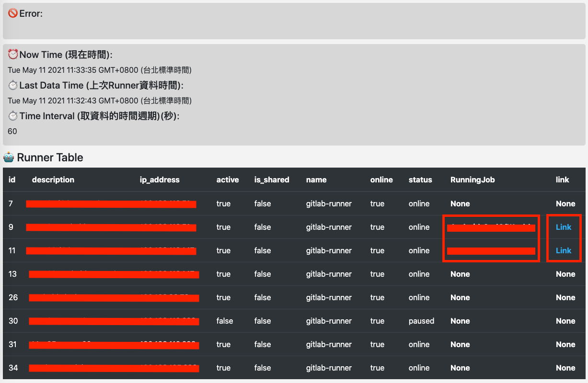

# GitLabRunnerTable
可以簡單"週期性" 取得 Private GitLab 的 "Runner 狀態"

### Demo

[GitLabRunnerTable (GitHubPage)](https://pinkpika.github.io/GitLabRunnerTable/)

### Setup
1. 設定 Domain
2. 設定個人專屬的 PRIVATE-TOKEN
3. 設定取資料的時間週期，例如每經過 60 秒就會檢查一次，並顯示在畫面上
4. 按下 "Get All Runner" 的按鈕，就可以泡咖啡 ☕

### Feature
1. 客製化 Private Domain
2. 客製化 時間週期
3. 週期性取得每個 Runner 狀態、IP、正在運行的工作、工作連結

⚠️ 如果 Private GitLab 的 Domain 不支援 HTTPS，會發生 `This request has been blocked; the content must be served over HTTPS`，解決方法是直接下載此 `index.html` 到本地執行即可!! ⚠️
